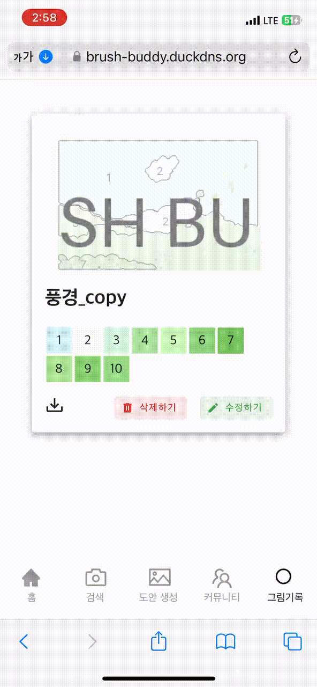
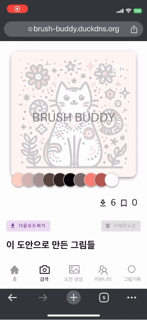

### 프로젝트 진행 기간

2023.01.09(월) ~ 2023.02.16(금)

## Team Members

  <table>
    <tr>
        <td align="center">
        
      </td>
      <td align="center">
        
      </td>
      <td align="center">
        
      </td>
      <td align="center">
        
      </td>
      <td align="center">
        
      </td>
      <td align="center">
        
      </td>
    </tr>
    <tr>
      <td align="center">
        <a href="">
         김영진
        </a>
        
FE, BE

      </td>
      <td align="center">
        <a href="https://github.com/">
          백승윤
        </a>
        
BE, Infra

      </td>
      <td align="center">
        <a href="https://github.com/">
          용희원
        </a>
        
FE, BE

      </td>
      <td align="center">
        <a href="https://github.com/">
          이상협
        </a>
        
Embedded

      </td>
      <td align="center">
        <a href="https://github.com/">
          이신애
        </a>
        
FE, BE

      </td>
      <td align="center">
        <a href="https://github.com/goflvhxj96">
          전소민
        </a>
        
FE, BE / 팀장

      </td>
    </tr>
  </table>

## 기획 배경
유투브 인기 컨텐츠인 절대 색감 챌린지를 보며 나도 저런 능력을 가지고싶다! 생각한 사람들을 위한 서비스입니다.  
  
누구나 원하는 도안과 컬러 팔레트로 한 점의 작품을 완성하는 성취감을 얻을 수 있도록 AI와 IoT기기를 이용했습니다.

## 개발환경

## 서비스 아키텍처

## ERD 다이어그램

### 📂디렉토리 구조

  

  백엔드 디렉토리 구조
  

    └─brushbuddy
      │  BrushBuddyApplication.java
      │
      ├─auth
      │  ├─client
      │  │      KakaoAuthApi.java
      │  │
      │  ├─config
      │  │      RestTemplateConfig.java
      │  │      SecurityConfig.java
      │  │      ValueConfig.java
      │  │
      │  ├─controller
      │  │      AuthController.java
      │  │
      │  ├─dto
      │  │      KakaoTokenDto.java
      │  │      KakaoUserData.java
      │  │      SignInResponse.java
      │  │
      │  ├─jwt
      │  │      CustomJwtAuthenticationEntryPoint.java
      │  │      JwtAuthenticationFilter.java
      │  │      JwtTokenProvider.java
      │  │      JwtValidationType.java
      │  │      UserAuthentication.java
      │  │
      │  ├─service
      │  │      AuthService.java
      │  │      KakaoService.java
      │  │
      │  └─vo
      │          Token.java
      │
      ├─board
      │  ├─controller
      │  │      BoardController.java
      │  │
      │  ├─domain
      │  │      Board.java
      │  │      Hashtag.java
      │  │      HashtagPK.java
      │  │      Heart.java
      │  │      HeartId.java
      │  │      Image.java
      │  │      Reply.java
      │  │
      │  ├─dto
      │  │      BoardDetailResponseDto.java
      │  │      BoardListRequestDto.java
      │  │      BoardListResponseDto.java
      │  │      BoardModifyRequestDto.java
      │  │      BoardWriteRequestDto.java
      │  │      ReplyListRequestDto.java
      │  │      ReplyListResponseDto.java
      │  │      ReplyWriteRequestDto.java
      │  │
      │  ├─repository
      │  │      BoardRepository.java
      │  │      BoardSearchCustom.java
      │  │      BoardSearchCustomImpl.java
      │  │      HashtagRepository.java
      │  │      HeartRepository.java
      │  │      HeartRepositoryCustom.java
      │  │      HeartRepositoryCustomImpl.java
      │  │      ImageRepository.java
      │  │      ReplyRepository.java
      │  │
      │  └─service
      │          BoardService.java
      │          BoardServiceImpl.java
      │
      ├─config
      │      MultipartConfig.java
      │      QueryDSLConfig.java
      │      S3Config.java
      │      SwaggerConfig.java
      │      WebConfig.java
      │
      ├─draft
      │  ├─controller
      │  │      DraftController.java
      │  │
      │  ├─domain
      │  │      Bookmark.java
      │  │      BookmarkId.java
      │  │      Category.java
      │  │      Draft.java
      │  │      DraftCategory.java
      │  │      DraftCategoryID.java
      │  │      Purchase.java
      │  │      PurchaseId.java
      │  │
      │  ├─dto
      │  │  ├─request
      │  │  │      DraftBoardListRequestDto.java
      │  │  │      DraftCategoryModifyRequestDto.java
      │  │  │      DraftCreateRequestDto.java
      │  │  │      DraftListRequestDto.java
      │  │  │      DraftMakeCountRequestDto.java
      │  │  │      DraftMakeRequestDto.java
      │  │  │      DraftMakeRequestSpringDto.java
      │  │  │
      │  │  └─response
      │  │          DraftCreateResponseDto.java
      │  │          DraftDetailResponseDto.java
      │  │          DraftListResponseDto.java
      │  │          DraftMakeResponseDto.java
      │  │
      │  ├─repository
      │  │  │  BookmarkRepository.java
      │  │  │  CategoryRepository.java
      │  │  │  PurchaseRepository.java
      │  │  │
      │  │  ├─Draft
      │  │  │      DraftCustom.java
      │  │  │      DraftCustomImpl.java
      │  │  │      DraftRepository.java
      │  │  │
      │  │  └─DraftCategory
      │  │          DraftCategoryCustom.java
      │  │          DraftCategoryCustomImpl.java
      │  │          DraftCategoryRepository.java
      │  │
      │  └─service
      │          DraftService.java
      │          DraftServiceImpl.java
      │
      ├─exception
      │      BaseException.java
      │      ErrorCode.java
      │      ErrorResponse.java
      │      GlobalExceptionHandler.java
      │
      ├─machine
      │  ├─controller
      │  │      MachineController.java
      │  │
      │  ├─domain
      │  │      Machine.java
      │  │      OwnerType.java
      │  │
      │  ├─dto
      │  │      MachinePrintRequestDto.java
      │  │      MachinePrintResponseDto.java
      │  │      MachineRegisterRequestDto.java
      │  │      MachineRegisterResponseDto.java
      │  │
      │  ├─repository
      │  │      MachineRepository.java
      │  │
      │  └─service
      │          MachineService.java
      │          MachineServiceImpl.java
      │
      ├─mileage
      │  ├─controller
      │  │      MileageController.java
      │  │
      │  ├─domain
      │  │      Mileage.java
      │  │      MileageLog.java
      │  │
      │  ├─dto
      │  │  ├─request
      │  │  │      MileageHistoryReqeustDto.java
      │  │  │      MileageSpendRequestDto.java
      │  │  │
      │  │  └─response
      │  │          MileageHistoryResponseDto.java
      │  │
      │  ├─repository
      │  │      MileageLogRepository.java
      │  │      MileageRepository.java
      │  │
      │  └─service
      │          MileageService.java
      │          MileageServiceImpl.java
      │
      ├─mypage
      │  ├─controller
      │  │      MypageController.java
      │  │
      │  ├─dto
      │  │  ├─request
      │  │  │      MypageBookmarkedDraftListRequestDto.java
      │  │  │      MypageGeneratedDraftListRequestDto.java
      │  │  │      MypageHeartBoardListRequestDto.java
      │  │  │      MypageModifyNicknameRequestDto.java
      │  │  │      MypageMyBoardListRequestDto.java
      │  │  │      MypagePurchasedDraftListRequestDto.java
      │  │  │
      │  │  └─response
      │  │          MypageBookmarkedDraftListResponseDto.java
      │  │          MypageGeneratedDraftListResponseDto.java
      │  │          MypageHeartBoardListResponseDto.java
      │  │          MypageMyBoardListResponseDto.java
      │  │          MypagePurchasedDraftListResponseDto.java
      │  │
      │  ├─repository
      │  │      MypageRepository.java
      │  │      MypageRepositoryImpl.java
      │  │
      │  └─service
      │          MypageService.java
      │          MypageServiceImpl.java
      │
      ├─palette
      │  ├─controller
      │  │      PaletteController.java
      │  │
      │  ├─domain
      │  │      Palette.java
      │  │
      │  ├─dto
      │  │      PaletteDetailResponseDto.java
      │  │      PaletteDuplicateResponseDto.java
      │  │      PaletteListRequestDto.java
      │  │      PaletteListResponseDto.java
      │  │      PaletteMakeRequestDto.java
      │  │      PaletteMakeResponseDto.java
      │  │      PaletteModifyRequestDto.java
      │  │
      │  ├─repository
      │  │      PaletteRepository.java
      │  │
      │  └─service
      │          PaletteService.java
      │          PaletteServiceImpl.java
      │
      ├─pay
      │  ├─client
      │  │      PayClient.java
      │  │
      │  ├─controller
      │  │      KakaopayController.java
      │  │
      │  ├─dto
      │  │  ├─request
      │  │  │      KakaopayApproveRequestDto.java
      │  │  │      KakaopayReadyRequestDto.java
      │  │  │
      │  │  └─response
      │  │          KakaopayAmountDto.java
      │  │          KakaopayApproveResponseDto.java
      │  │          KakaopayCardInfoDto.java
      │  │          KakaopayReadyResponseDto.java
      │  │
      │  └─service
      │          KakaopayService.java
      │
      ├─user
      │  ├─controller
      │  │      UserController.java
      │  │
      │  ├─domain
      │  │      Gender.java
      │  │      User.java
      │  │
      │  ├─dto
      │  │  ├─request
      │  │  │      UserRequestDto.java
      │  │  │
      │  │  └─response
      │  │          UserInfoResponseDto.java
      │  │
      │  ├─repository
      │  │      UserRepository.java
      │  │
      │  └─service
      │          UserService.java
      │          UserServiceImpl.java
      │
      ├─util
      │      JwtUtil.java
      │      S3Uploader.java
      │
      └─workplace
          └─domain
                  Workplace.java
  
 

  

  프론트엔드 디렉토리 구조
  

    ├── App.vue
    ├── api
    │   ├── axios.ts
    │   ├── board.ts
    │   ├── draft.ts
    │   ├── machine.ts
    │   ├── palette.ts
    │   ├── type.ts
    │   └── user.ts
    ├── assets
    │   ├── background.png
    │   ├── icon
    │   ├── images
    │   ├── kakao.png
    │   └── logo.png
    ├── components
    │   ├── Community
    │   ├── CommunityComponent.vue
    │   ├── Diary
    │   ├── Draft
    │   ├── DraftDetail
    │   ├── NavigationComponent.vue
    │   ├── Palette
    │   ├── Pay
    │   ├── Search
    │   ├── SearchComponent.vue
    │   └── common
    ├── main.ts
    ├── router
    │   └── index.ts
    ├── stores
    │   ├── boardlike.ts
    │   ├── bookmark.ts
    │   ├── counter.ts
    │   ├── image.ts
    │   ├── menutypes.ts
    │   ├── pay.ts
    │   └── user.ts
    ├── views
    │   ├── CommunityBoardListView.vue
    │   ├── CommunityDetailView.vue
    │   ├── CommunityModifyView.vue
    │   ├── DiaryView.vue
    │   ├── DraftCreateAIView.vue
    │   ├── DraftDetailView.vue
    │   ├── DraftPipoMakeView.vue
    │   ├── DraftView.vue
    │   ├── DraftWrite.vue
    │   ├── HomeListView.vue
    │   ├── HomeView.vue
    │   ├── LoginView.vue
    │   ├── PaletteDetailView.vue
    │   ├── SearchView.vue
    │   ├── payCharge.vue
    │   └── payView.vue
    └── vite-env.d.ts

## 주요기능 및 화면

### 소셜로그인
클릭 한 번으로 간편하게 로그인합니다.  

### 생성형 AI로 기반 그림 생성하기
openAI의 DallE를 이용해 사용자 맞춤 그림을 생성합니다.  
  

### 자동 도안 변환하기
AI로 생성한 그림을 알고리즘을 통해 피포페인팅 도안와 컬러 팔레트로 변환합니다.  
  

### 팔레트 복사/수정하기
다른 사람들이 공유한 도안을 복사해 나만의 팔레트를 커스텀합니다.  
  

### 물감 출력하기
QR로 웹과 기기를 연결해 물감을 출력합니다.  
  

### 도안 구매하기
도안을 구매하면 워터마크 없는 이미지를 다운받을 수 있습니다.  
  

### 커뮤니티
도안와 연계된 커뮤니티 글을 해당 도안과 연계해 보여줍니다.  
  

커뮤니티에서 소통을 할 수 있습니다.  
  

